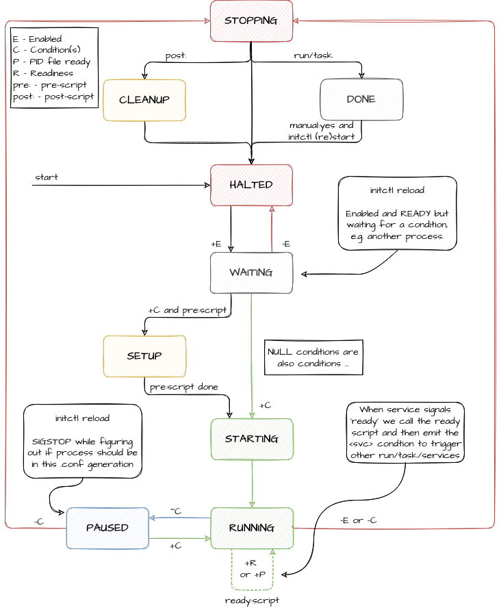

Finit Services
==============

Starting & Monitoring
---------------------

Finit can start and monitor the following types of daemons:

* Forks to background, creates a PID file
* Runs in foreground:
  - creates a PID file
  - does not create a PID file -- Finit can create it for you (optional)

Finit can *not* start and monitor a daemon that:

* Forks to background and does *not* create a PID file

|   | Forking | Creates PID File | Finit can create PID File |
|---|---------|------------------|---------------------------|
| ✔ | Yes     | Yes              | N/A                       |
| ✔ | No      | Yes              | N/A                       |
| ✔ | No      | No               | Yes                       |
| ✘ | Yes     | No               | No                        |

> **Note:** PID files is one mechanism used to assert conditions to
> synchronize the start and stop of other, dependent, services.

### Forks to Background w/ PID File

    service pid:!/run/serv.pid serv       -- Forking service

### Runs in Foreground w/ PID File

    service                    serv -n -p -- Foreground service w/ PID file

### Runs in Foreground w/o PID File

Same as previous, but we tell Finit to create the PID file, because we
need it to synchronize start/stop of a dependent service.

    service pid:/run/serv.pid  serv -n    -- Foreground service w/o PID file

### Runs in Foreground w/ Custom PID File

    service pid:/run/servy.pid serv -n -p -P /run/servy.pid -- Foreground service w/ custom PID file

State Machine
-------------

A service is bound to a state machine that is in one of six (6) states.
For `run`s and `task`s there is an additional end state called `DONE`,
not shown in the diagram for brevity.  Services start in the `HALTED`
state.

The current state depends on the two following conditions:

* `E`: Service enabled. In order for `E` to be satisfied, the service
  must be allowed to run in the current runlevel and not be stopped.
  
  A service may be stopped, or blocked, for several reasons:

  - The user has manually stopped the service using `initctl stop NAME`
  - The program exits immediately. I.e. keeps crashing (make sure to use
    the 'run this service in the foreground' command line option)
  - The binary is missing in the filesystem

* `C`: Service conditions are satisfied:

  - `on` (+): The condition is asserted.
  - `off` (-): The condition is deasserted.
  - `flux` (~): The condition state is unknown.

For a detailed description of conditions, and how to debug them,
see the [Finit Conditions](conditions.md) document.
